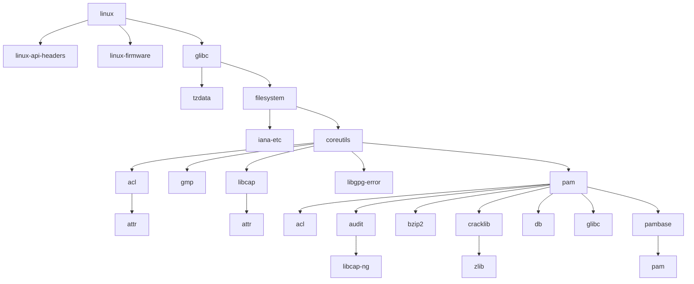

# 配置是一幅描绘系统的蓝图

如果你尝试修改过 NixOS 的配置文件，你就会明白配置文件中书写的内容实际上是你希望
下次生成的系统。我们相信这是广大 NixOS 新手的基本认知。

## 中心化的配置文件带来管理的便捷

既然是根据配置文件生成系统，我们肯定希望配置文件是集中的，而不是零零散散的
dotfiles。它最好使用统一的语法描述，而不是 XML、YAML、TOML、json 等各种格式。而
NixOS 正是使用 Nix 语言来抹平这道沟壑。

Nix 文件就是使用 Nix 语言编写的源码文件，它们可以互相导入（就像常见的脚本一
样），你可以将它们当作项目一样去组织。

## 依赖计算

我们通常会在配置文件里自定义某个软件的选项，从而不自觉地引入了包。声明式配置带来
的好处之一就是所有的包和依赖都是确定的，配置文件不再仅仅是单纯的源码，还是一个关
系图。

因为配置使用了 Nix 语言，打包也使用了 Nix 语言，Nix 包管理器能够全程参与计算。我
们将软件构建任务抽象成一个结点，软件构建往往会有其他依赖，若干结点构成了图，Nix
只需要保证这个关系图是有向无环的。

<!-- prettier-ignore -->
::: tip
保证无环是为了让 Nix 能够有明确的构建顺序，使之能够并行构建，并且解决循环依赖的
问题。

<!-- prettier-ignore -->
:::

在 NixOS 中你需要执行生成命令，才会重新计算依赖，生成新生代（新状态）。
